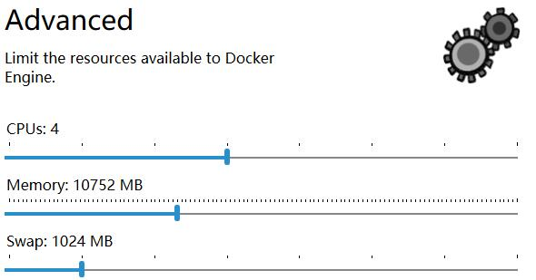
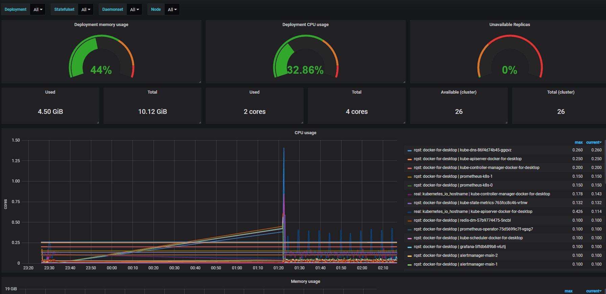

# Introduction
This is a sample to show how to monitor the kubernetes right now.Heapster is now ***retired***. 
There are some new components to replace it. 
The following are potential migration paths for Heapster functionality:

- **For basic CPU/memory HPA metrics**: Use [metrics-server](https://github.com/kubernetes-incubator/metrics-server).

- **For general monitoring**: Consider a third-party monitoring pipeline that can gather Prometheus-formatted metrics.
  The kubelet exposes all the metrics exported by Heapster in Prometheus format.
  One such monitoring pipeline can be set up using the [Prometheus Operator](https://github.com/coreos/prometheus-operator), which
  deploys Prometheus itself for this purpose.

- **For event transfer**: Several third-party tools exist to transfer/archive Kubernetes events, depending on your sink.
  [heptiolabs/eventrouter](https://github.com/heptiolabs/eventrouter) has been suggested as a general alternative.
  
Here will show how they work together.

# Metrics Server
Clone the repo from [github](https://github.com/kubernetes-incubator/metrics-server), only need copy files from `metrics-server/deploy/1.8+/` 
to [metrics-server directory](./kubernetes/metrics-server/). 

## Deploy
If you meet some troubles when you deploy as follows, please jump to [TroubleShooting](#metrics-server-trouble-shooting).
```bash
$ kubectl create -f ./kubernetes/metrics-server/
clusterrole.rbac.authorization.k8s.io "system:aggregated-metrics-reader" created
clusterrolebinding.rbac.authorization.k8s.io "metrics-server:system:auth-delegator" created
rolebinding.rbac.authorization.k8s.io "metrics-server-auth-reader" created
apiservice.apiregistration.k8s.io "v1beta1.metrics.k8s.io" created
serviceaccount "metrics-server" created
deployment.extensions "metrics-server" created
service "metrics-server" created
clusterrole.rbac.authorization.k8s.io "system:metrics-server" created
clusterrolebinding.rbac.authorization.k8s.io "system:metrics-server" created
```

## Test
First, watch logs of the metrics-server pod, here is the core snippet
```text
I0605 16:10:26.365931       1 manager.go:95] Scraping metrics from 1 sources
I0605 16:10:26.373597       1 manager.go:120] Querying source: kubelet_summary:docker-for-desktop
I0605 16:10:26.438348       1 manager.go:150] ScrapeMetrics: time: 72.3597ms, nodes: 1, pods: 21
I0605 16:18:59.204973       1 manager.go:95] Scraping metrics from 1 sources
I0605 16:18:59.208306       1 manager.go:120] Querying source: kubelet_summary:docker-for-desktop
I0605 16:18:59.275686       1 manager.go:150] ScrapeMetrics: time: 70.6443ms, nodes: 1, pods: 21
I0605 16:19:59.204904       1 manager.go:95] Scraping metrics from 1 sources
```
Then use `kubectl top node` get the metrics info of the node.
```bash
$ kubectl top node
NAME                 CPU(cores)   CPU%      MEMORY(bytes)   MEMORY%
docker-for-desktop   433m         10%       5097Mi          49%
```
As you see, here is using the kubernetes in docker. The resources currently allocated to docker are as follows

Last, we can use `kubectl top pods --all-namespaces` get metrics info of all pods in all namespaces:
```bash
$ kubectl top pods --all-namespaces
NAMESPACE         NAME                                             CPU(cores)   MEMORY(bytes)
docker            compose-74649b4db6-qtfrj                         4m           7Mi
docker            compose-api-845c9c5c59-ls2z9                     2m           14Mi
ingress-nginx     nginx-ingress-controller-56fdb9b799-9lkqn        5m           95Mi
ingress-nginx     nginx-ingress-default-backend-6d4d6857bb-h6r6z   1m           2Mi
kube-system       etcd-docker-for-desktop                          43m          99Mi
kube-system       kube-apiserver-docker-for-desktop                85m          619Mi
kube-system       kube-controller-manager-docker-for-desktop       107m         69Mi
kube-system       kube-dns-86f4d74b45-ggqvz                        4m           24Mi
kube-system       kube-proxy-n49qc                                 8m           15Mi
kube-system       kube-scheduler-docker-for-desktop                34m          13Mi
kube-system       kubernetes-dashboard-669f9bbd46-pjdf4            3m           21Mi
kube-system       metrics-server-5fd74bd86f-r2tn6                  1m           11Mi
kube-system       tiller-deploy-7c87ff9ddc-578kg                   1m           7Mi
springboot-kube   consumer-service-dm-7d694996c-cpxmv              3m           973Mi
springboot-kube   consumer-service-dm-7d694996c-j7l87              2m           830Mi
springboot-kube   gateway-service-dm-f4485bb4-6vkj8                1m           360Mi
springboot-kube   gateway-service-dm-f4485bb4-79dk6                1m           535Mi
springboot-kube   producer-service-dm-ddbb6477d-s9ft6              2m           309Mi
springboot-kube   producer-service-dm-ddbb6477d-tvf58              2m           300Mi
springboot-kube   redis-dm-57b9774475-5ncbl                        2m           2Mi
volumn-ns         dnsutils                                         0m           0Mi
```
We can get metrics info with another way by kube-proxy
```bash
$ kubectl get --raw http://127.0.0.1:8001/apis/metrics.k8s.io/v1beta1/nodes
$ kubectl get --raw http://127.0.0.1:8001/apis/metrics.k8s.io/v1beta1/pods
``` 

## <span id="metrics-server-trouble-shooting">TroubleShooting</span>
- Modify the property value of imagePullPolicy from `Always` to `IfNotPresent` when your network can not work right now.
- [no metrics known for pod](https://github.com/kubernetes-incubator/metrics-server/issues/237), Add command setting in yaml as follows:

```yaml
  command:
    - /metrics-server
    - --kubelet-insecure-tls
    - --v=2
    - --kubelet-preferred-address-types=InternalIP
```


# EventRouter
## Deploy
As the metrics-server, we can also clone the repo from [github](https://github.com/heptiolabs/eventrouter), or use remote yaml directly:
```bash
$ kubectl create -f https://raw.githubusercontent.com/heptiolabs/eventrouter/master/yaml/eventrouter.yaml
```
If you meet some troubles when you deploy, please jump to [TroubleShooting](#eventrouter-trouble-shooting).

## Test
Before, there is a deployment resource deployed in a namespace named springboot-kube. 
Now through command `kubectl scale` to add a new pod for the deployment resource named `gateway-service-dm`. 
```bash
$ kubectl scale -n springboot-kube deployment  gateway-service-dm  --replicas=2
deployment.extensions/gateway-service-dm scaled
```
Then, Watch the log of the pod name eventrouter-** by `kubectl log -f -n kube-system eventrouter-7fcfd6f66-m6jmt`
```text
I0606 04:55:50.225060       8 glogsink.go:42] {"verb":"ADDED","event":{"metadata":{"name":"gateway-service-dm.15a5830fde8e6bfc","namespace":"springboot-kube","selfLink":"/api/v1/namespaces/springboot-kube/e
vents/gateway-service-dm.15a5830fde8e6bfc","uid":"5ad9eb2c-8817-11e9-9c27-00155d0311e4","resourceVersion":"2159535","creationTimestamp":"2019-06-06T04:55:50Z"},"involvedObject":{"kind":"Deployment","namespa
ce":"springboot-kube","name":"gateway-service-dm","uid":"7020307f-82c2-11e9-9f93-00155d0311d4","apiVersion":"extensions","resourceVersion":"2159532"},"reason":"ScalingReplicaSet","message":"Scaled up replic
a set gateway-service-dm-f4485bb4 to 2","source":{"component":"deployment-controller"},"firstTimestamp":"2019-06-06T04:55:50Z","lastTimestamp":"2019-06-06T04:55:50Z","count":1,"type":"Normal"}}
I0606 04:55:50.457869       8 glogsink.go:42] {"verb":"ADDED","event":{"metadata":{"name":"gateway-service-dm-f4485bb4.15a5830fe93d719c","namespace":"springboot-kube","selfLink":"/api/v1/namespaces/springbo
ot-kube/events/gateway-service-dm-f4485bb4.15a5830fe93d719c","uid":"5af56867-8817-11e9-9c27-00155d0311e4","resourceVersion":"2159540","creationTimestamp":"2019-06-06T04:55:50Z"},"involvedObject":{"kind":"Re
plicaSet","namespace":"springboot-kube","name":"gateway-service-dm-f4485bb4","uid":"7021401d-82c2-11e9-9f93-00155d0311d4","apiVersion":"extensions","resourceVersion":"2159533"},"reason":"SuccessfulCreate","
message":"Created pod: gateway-service-dm-f4485bb4-z8klb","source":{"component":"replicaset-controller"},"firstTimestamp":"2019-06-06T04:55:50Z","lastTimestamp":"2019-06-06T04:55:50Z","count":1,"type":"Norm
al"}}
I0606 04:55:50.632295       8 glogsink.go:42] {"verb":"ADDED","event":{"metadata":{"name":"gateway-service-dm-f4485bb4-z8klb.15a5830ff101f8e4","namespace":"springboot-kube","selfLink":"/api/v1/namespaces/sp
ringboot-kube/events/gateway-service-dm-f4485bb4-z8klb.15a5830ff101f8e4","uid":"5b0928fc-8817-11e9-9c27-00155d0311e4","resourceVersion":"2159542","creationTimestamp":"2019-06-06T04:55:50Z"},"involvedObject"
:{"kind":"Pod","namespace":"springboot-kube","name":"gateway-service-dm-f4485bb4-z8klb","uid":"5af049b8-8817-11e9-9c27-00155d0311e4","apiVersion":"v1","resourceVersion":"2159537"},"reason":"Scheduled","mess
age":"Successfully assigned gateway-service-dm-f4485bb4-z8klb to docker-for-desktop","source":{"component":"default-scheduler"},"firstTimestamp":"2019-06-06T04:55:50Z","lastTimestamp":"2019-06-06T04:55:50Z"
,"count":1,"type":"Normal"}}
I0606 04:55:50.688361       8 glogsink.go:42] {"verb":"ADDED","event":{"metadata":{"name":"gateway-service-dm-f4485bb4-z8klb.15a5830ffe23395c","namespace":"springboot-kube","selfLink":"/api/v1/namespaces/sp
ringboot-kube/events/gateway-service-dm-f4485bb4-z8klb.15a5830ffe23395c","uid":"5b2ab4cb-8817-11e9-9c27-00155d0311e4","resourceVersion":"2159545","creationTimestamp":"2019-06-06T04:55:50Z"},"involvedObject"
:{"kind":"Pod","namespace":"springboot-kube","name":"gateway-service-dm-f4485bb4-z8klb","uid":"5af049b8-8817-11e9-9c27-00155d0311e4","apiVersion":"v1","resourceVersion":"2159539"},"reason":"SuccessfulMountV
olume","message":"MountVolume.SetUp succeeded for volume \"default-token-2cjd8\" ","source":{"component":"kubelet","host":"docker-for-desktop"},"firstTimestamp":"2019-06-06T04:55:50Z","lastTimestamp":"2019-
06-06T04:55:50Z","count":1,"type":"Normal"}}
I0606 04:55:52.689520       8 glogsink.go:42] {"verb":"ADDED","event":{"metadata":{"name":"gateway-service-dm-f4485bb4-z8klb.15a58310755f0cf8","namespace":"springboot-kube","selfLink":"/api/v1/namespaces/sp
ringboot-kube/events/gateway-service-dm-f4485bb4-z8klb.15a58310755f0cf8","uid":"5c5c009b-8817-11e9-9c27-00155d0311e4","resourceVersion":"2159548","creationTimestamp":"2019-06-06T04:55:52Z"},"involvedObject"
:{"kind":"Pod","namespace":"springboot-kube","name":"gateway-service-dm-f4485bb4-z8klb","uid":"5af049b8-8817-11e9-9c27-00155d0311e4","apiVersion":"v1","resourceVersion":"2159539","fieldPath":"spec.container
s{gateway-service}"},"reason":"Pulled","message":"Container image \"local-dtr.com/kube-gateway-service:Develop\" already present on machine","source":{"component":"kubelet","host":"docker-for-desktop"},"fir
stTimestamp":"2019-06-06T04:55:52Z","lastTimestamp":"2019-06-06T04:55:52Z","count":1,"type":"Normal"}}
I0606 04:55:53.289213       8 glogsink.go:42] {"verb":"ADDED","event":{"metadata":{"name":"gateway-service-dm-f4485bb4-z8klb.15a5831091bb6a18","namespace":"springboot-kube","selfLink":"/api/v1/namespaces/sp
ringboot-kube/events/gateway-service-dm-f4485bb4-z8klb.15a5831091bb6a18","uid":"5ca48df3-8817-11e9-9c27-00155d0311e4","resourceVersion":"2159549","creationTimestamp":"2019-06-06T04:55:53Z"},"involvedObject"
:{"kind":"Pod","namespace":"springboot-kube","name":"gateway-service-dm-f4485bb4-z8klb","uid":"5af049b8-8817-11e9-9c27-00155d0311e4","apiVersion":"v1","resourceVersion":"2159539","fieldPath":"spec.container
s{gateway-service}"},"reason":"Created","message":"Created container","source":{"component":"kubelet","host":"docker-for-desktop"},"firstTimestamp":"2019-06-06T04:55:53Z","lastTimestamp":"2019-06-06T04:55:5
3Z","count":1,"type":"Normal"}}
I0606 04:55:53.879688       8 glogsink.go:42] {"verb":"ADDED","event":{"metadata":{"name":"gateway-service-dm-f4485bb4-z8klb.15a58310bbe6eb50","namespace":"springboot-kube","selfLink":"/api/v1/namespaces/sp
ringboot-kube/events/gateway-service-dm-f4485bb4-z8klb.15a58310bbe6eb50","uid":"5d109a99-8817-11e9-9c27-00155d0311e4","resourceVersion":"2159552","creationTimestamp":"2019-06-06T04:55:53Z"},"involvedObject"
:{"kind":"Pod","namespace":"springboot-kube","name":"gateway-service-dm-f4485bb4-z8klb","uid":"5af049b8-8817-11e9-9c27-00155d0311e4","apiVersion":"v1","resourceVersion":"2159539","fieldPath":"spec.container
s{gateway-service}"},"reason":"Started","message":"Started container","source":{"component":"kubelet","host":"docker-for-desktop"},"firstTimestamp":"2019-06-06T04:55:53Z","lastTimestamp":"2019-06-06T04:55:5
3Z","count":1,"type":"Normal"}}
```
We will see some key words like `Scaled up`,`Created pod` and so on.

## <span id="eventrouter-trouble-shooting">TroubleShooting</span>
- [SchemaError(io.k8s.apimachinery.pkg.apis.meta.v1.APIGroup_v2): invalid object doesn't have additional properties
](https://github.com/ubuntu/microk8s/issues/407)

> Download the right version of kubectl installed by docker in the path "C:\Program Files\Docker\Docker\resources\bin", Manual download from https://kubernetes.io/docs/tasks/tools/install-kubectl/#install-kubectl-on-windows.


# Prometheus Operator
The Prometheus Operator for Kubernetes provides easy monitoring definitions for Kubernetes services and deployment and management of Prometheus instances.
There are three ways for us to install it.
1. [`Prometheus Operator`](https://github.com/coreos/prometheus-operator)
2. [`kube-prometheus`](https://github.com/coreos/kube-prometheus)
3. [`community helm chart`](https://github.com/helm/charts/tree/master/stable/prometheus-operator)

See more differences of them in [website](https://github.com/coreos/prometheus-operator/blob/master/README.md#prometheus-operator-vs-kube-prometheus-vs-community-helm-chart).
Here will use the `kube-prometheus` way to test. 

**Note**
> Check your kubernetes cluster version, if it is before 1.14. Then download the zip file from https://github.com/coreos/kube-prometheus/releases.

## Deploy
```bash
$ kubectl create -f ./kubernetes/kube-prometheus/
```
**Note**:When using the kubernetes in docker, maybe you need to execute `kubectl delete -f ./kubernetes/kube-prometheus/node-exporter-daemonset.yaml`, it depends on linux os.

## Expose Port
- Expose *prometheus* access port
```bash
$ kubectl --namespace monitoring port-forward svc/prometheus-k8s 9090
```
Then access via http://localhost:9090

- Expose *grafana* access port
```bash
$ kubectl --namespace monitoring port-forward svc/grafana 3000
```
Then access via http://localhost:3000 and use the default grafana user:password of admin:admin.

- Expose *alert manager* access port
```bash
$ kubectl --namespace monitoring port-forward svc/alertmanager-main 9093
```
Then access via http://localhost:9093

## Test
Login into grafana with admin:admin, then import some dashboard templates for kubernetes which can be searched from 
[grafana official website](https://grafana.com/dashboards?search=kubernetes). 

Example, dashboard id is 8588: 


## Clean Up
```bash
$ kubectl delete -f ./kubernetes/kube-prometheus/
```